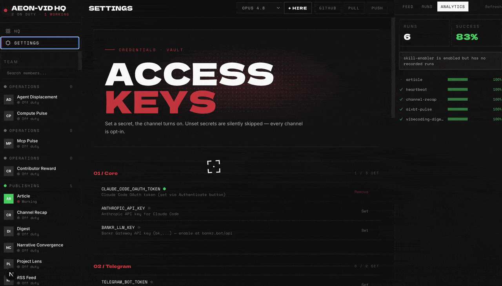
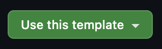
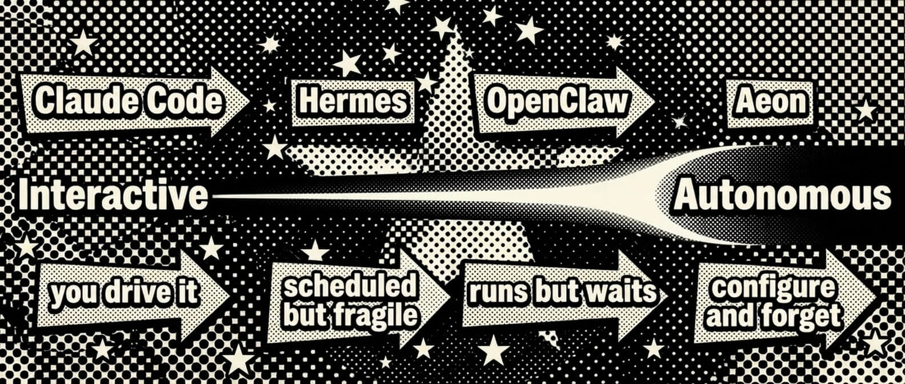
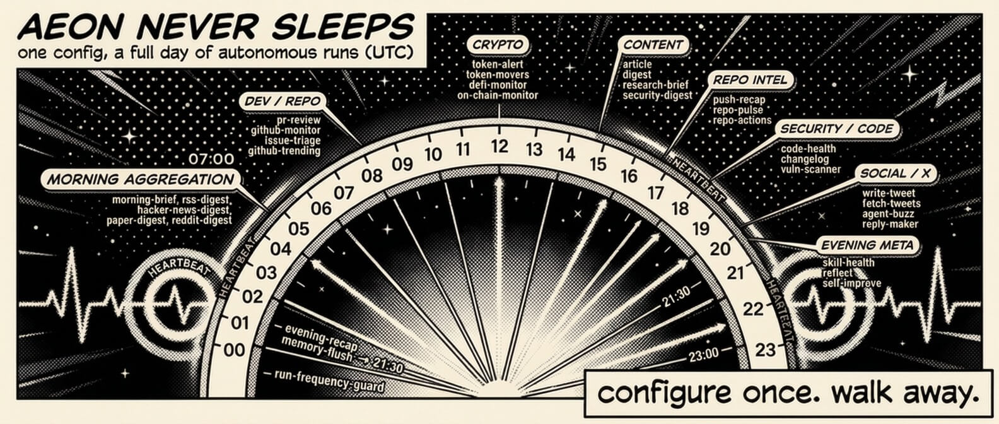
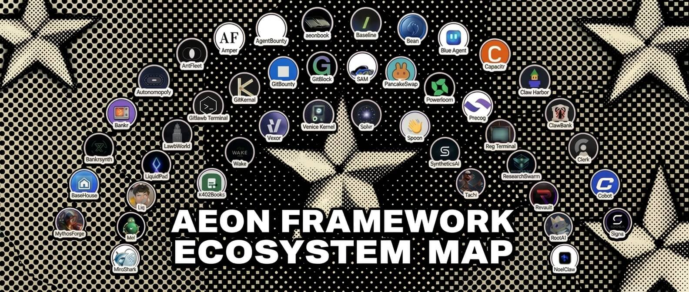

<p align="center">
  
</p>

<h1 align="center">AEON</h1>

<p align="center">
  <a href="https://github.com/aeonfun/aeon/stargazers"></a>
  <a href="https://github.com/aeonfun/aeon/network/members"></a>
  <a href="https://x.com/aeonframework"></a>
  <a href="https://bankr.bot/discover/0xbf8e8f0e8866a7052f948c16508644347c57aba3"></a>
</p>

<p align="center">
  <strong>The most autonomous agent framework.</strong><br>
  Give it a direction and it gets the work done: ships features to your repos, finds and privately discloses real vulnerabilities, deploys live apps, runs deep research - and writes new skills for itself. No approval loops. No babysitting. Configure once, forget forever.
</p>

<p align="center">
  
</p>

---

## Quick start

You need three things:

1. **Node.js 20+** - grab the LTS installer from [nodejs.org](https://nodejs.org/en/download), or use a package manager: `brew install node` (macOS), `winget install OpenJS.NodeJS.LTS` (Windows), [nvm](https://github.com/nvm-sh/nvm) or your distro's package manager (Linux). Already have it? `node -v` should print 20 or higher.
2. **[GitHub CLI](https://cli.github.com/) (`gh`), authenticated** - the dashboard uses it for everything (secrets, workflows), and `./aeon` checks it before starting. Install: `brew install gh` (macOS), `winget install --id GitHub.cli` (Windows), [per-distro instructions](https://github.com/cli/cli/blob/trunk/docs/install_linux.md) (Linux). Then run `gh auth login` and follow the prompts.
3. **Your own copy of this repo** - click **Use this template** at the top of [the repo page](https://github.com/aeonfun/aeon) - keep it public, Actions minutes are free on public repos. CLI version: `gh repo fork aeonfun/aeon --clone`.

   

```bash
git clone https://github.com/<you>/aeon   # skip if you used `gh repo fork --clone`
cd aeon && ./aeon
```

Open [http://localhost:5555](http://localhost:5555) and follow the four steps:

1. **Authenticate** - connect your Claude Pro/Max subscription or your X account (for the [Grok harness](../docs/harnesses.md)), or paste an API key - Anthropic, Anthropic-compatible, or an [LLM gateway](../docs/CONFIGURATION.md#llm-gateways) key, routed automatically by prefix.
2. **Add a channel** - [Telegram, Discord, Slack, or email](#notifications) so Aeon can talk to you.
3. **Pick skills** - toggle what you want, set schedules. Each skill shows the API keys and MCP servers it needs, with one-click setup.
4. **Run** - hit **Run now** on any skill to try it immediately; API keys and `var` values apply directly, no push needed. When you change config (schedules, toggles), **Push** commits it to GitHub in one click so Actions runs it on cron.

That's it - Aeon now runs unattended.

Dashboard views, local dev, env vars, and remote access are documented in [`apps/dashboard/README.md`](../apps/dashboard/README.md).

**Prefer the terminal?** Everything the dashboard does is also a command - `./aeon skills ls`, `./aeon skills enable <name>`, `./aeon secrets set …`, `./aeon runs logs <id>`. Same logic, no browser, scriptable with `--json`. See [Command line](../apps/cli/README.md).

<details>
<summary><strong>No admin rights / can't install <code>gh</code>?</strong></summary>

Grab the `gh_*_macOS_arm64.zip` (or your platform's binary) from [github.com/cli/cli/releases](https://github.com/cli/cli/releases) and drop it on your `PATH` (e.g. `~/.local/bin`). Then `gh auth login`.

</details>

---

## What Aeon can do

**A skill is a Markdown file: some frontmatter, then a prompt.** No plugin API, nothing to compile. Here's a real one, trimmed:

```yaml
# skills/digest/SKILL.md
---
name: digest
category: basics                 # which pack it belongs to
description: Generate and send a digest on a configurable topic
requires: [XAI_API_KEY?]         # ? = optional key, bare = required
var: ""                          # per-run input - "solana", "rust", "AI agents"…
mode: write
---
```
> Today is ${today}. Generate and send a daily **${var}** digest.
>
> The whole point of a digest is **signal, not volume**. A reader skimming for 60 seconds should walk away with three things they didn't know that morning and one of them should change a decision they'd make this week. Anything that doesn't clear that bar gets cut.

The prompt *is* the skill, judgment and all. You schedule it, hand it a `var`, chain it into others, and Haiku rates every run. **Six packs ship in the box** - Core, Evolution, and Basics are on by default; enable the rest in the dashboard's **Packs** view (a visibility switch, it runs nothing). Full catalog below; how packs work: [`docs/skill-packs.md`](../docs/skill-packs.md).

| Pack | Key | Skills | Examples |
| --- | --- | --- | --- |
| **Core** - fleet coordination, self-config, liveness; shown by default | `core` | 11 | `fleet-control`, `spawn-instance`, `auto-workflow` |
| **Evolution** - authors, evolves, installs & heals its own skills; shown by default | `evolution` | 7 | `create-skill`, `autoresearch`, `skill-repair` |
| **Basics** - simple, immediately-runnable skills; shown by default | `basics` | 13 | `digest`, `token-movers`, `pr-review` |
| **Dev & Code** | `dev` | 8 | `github-monitor`, `feature`, `deploy-prototype` |
| **Crypto & Markets** | `crypto` | 12 | `token-pick`, `defi-overview`, `ctrl` |
| **Productivity** | `productivity` | 8 | `mention-radar`, `send-email`, `okf-export` |

<details>
<summary><strong>Full catalog (all 59 skills by pack)</strong></summary>

Three packs are shown by default (**Core**, **Evolution**, **Basics**); the rest are revealed on demand.

| Pack | Skills |
|------|--------|
| **Core** (`core`, 11) | `auto-merge`,`auto-workflow`,`fleet-control`,`fork-fleet`,`heartbeat`,`memory-flush`,`narrative-convergence`,`shiplog`,`soul-builder`,`spawn-instance`,`strategy-builder` |
| **Evolution** (`evolution`, 7) | `autoresearch`,`create-skill`,`install-skill`,`search-skill`,`self-improve`,`skill-health`,`skill-repair` |
| **Basics** (`basics`, 13) | `action-converter`,`article`,`bd-radar`,`digest`,`fetch-tweets`,`github-trending`,`idea-forge`,`last30`,`pr-review`,`price-alert`,`token-movers`,`tx-explain`,`write-tweet` |
| **Dev & Code** (`dev`, 8) | `changelog`,`deploy-prototype`,`feature`,`github-monitor`,`inbox-triage`,`pr-triage`,`vuln-scanner`,`vuln-tracker` |
| **Crypto & Markets** (`crypto`, 12) | `base-mcp`,`ctrl`,`defi-overview`,`distribute-tokens`,`investigation-report`,`monitor-polymarket`,`narrative-tracker`,`onchain-monitor`,`picks-tracker`,`pm-manipulation`,`token-pick`,`unlock-monitor` |
| **Productivity** (`productivity`, 8) | `idea-pipeline`,`mention-radar`,`okf-export`,`okf-ingest`,`operator-scorecard`,`reply-maker`,`schedule-ads`,`send-email` |

Authoritative source: [`skills.json`](../catalog/skills.json) + [`packs.json`](../catalog/packs.json), the dashboard **Packs** view, or `bin/add-skill aeonfun/aeon --list`. A skill's pack comes from its `category:` frontmatter - see [`docs/skill-packs.md`](../docs/skill-packs.md).

</details>

### It heals itself


Every skill output is automatically scored 1–5 by Haiku after each run. Scores and failure flags (`api_error`, `stale_data`, `rate_limited`) are tracked per skill in `memory/skill-health/` with a rolling 30-run history. When something breaks, the loop fixes it without you:

1. **`heartbeat`** (daily) - detects failed, stuck, or chronically broken skills
2. **`skill-health`** - audits quality scores and flags API degradation patterns
3. **`skill-repair`** - diagnoses and patches failing skills automatically
4. **`self-improve`** - evolves prompts, config, and workflows based on performance

Health skills file issues, repair skills close them. `heartbeat` is the only skill enabled by default: nothing to report → silent; something needs attention → one notification. Deep dive: [`docs/CORE.md`](../docs/CORE.md).

**Votable health** (on by default - set the repo variable `HEALTH_ISSUES=0` to turn it off): when a skill regresses (a Haiku score of 1–2 or a failure flag), the loop opens or comments on a per-skill GitHub Issue titled `health: <skill>`; clean runs stay silent, so there's no issue spam. 👍/👎 the issue and `self-improve` / `skill-repair` triage the most-voted, worst-scoring skills first - a visible, conflict-free repair queue you can steer.

### It replicates

Aeon can spawn and manage copies of itself. `spawn-instance` forks the repo into a new specialized instance (`var: "crypto-tracker: monitor DeFi protocols"`), selects relevant skills, and registers it in `memory/instances.json` - no secrets propagated, billing stays isolated. `fleet-control` health-checks and dispatches across instances; its `scorecard` mode tracks fleet economics.

### It ships real work

- **`feature`** - ships code unprompted, to your watched repos or any repo with `var: external:<owner/repo>`.
- **`deploy-prototype`** - generates and deploys live web apps to Vercel.
- **`vuln-scanner`** - finds real code vulnerabilities and reports them only through the maintainer's private channel (GitHub's advisory system or a private email, never a public issue), with drafts waiting for your review by default and any project that declines AI-authored reports skipped.
- **`autoresearch`** - evolves existing skills through scored variations.
- **`create-skill`** - generates new ones from a sentence.

### Add more skills

```bash
bin/add-skill aeonfun/aeon --list        # browse the built-in catalog
bin/add-skill BankrBot/skills bankr hydrex  # install from any GitHub repo
bin/add-skill BankrBot/skills --all         # install everything from a repo
bin/export-skill token-movers               # package one for standalone use
```

Installed skills land in `skills/` and are added to `aeon.yml` disabled - flip `enabled: true` to activate. You can also:

- **Build your own** from [`docs/examples/skill-templates/`](../docs/examples/skill-templates/TEMPLATE.md): `bin/new-from-template <template> <skill-name> --category <pack>` - the `--category` slots it into a pack (or set `category:` in the SKILL.md frontmatter). See [`docs/skill-packs.md`](../docs/skill-packs.md).
- **Use one skill elsewhere** without forking: drop a portable workflow from [`docs/examples/workflow-templates/`](../docs/examples/workflow-templates) into any repo's `.github/workflows/`.
- **Label any GitHub issue `ai-build`** - Claude reads the issue, implements it, and opens a PR
- **Install community packs** - see [Community Packs](#community-packs)

---

## Proof of work

Aeon's skills ship to production. These numbers are live at **[aeon.fun](https://www.aeon.fun)**.

| Skill | In production |
|-------|---------------|
| **`vuln-scanner`** | **~1.6M GitHub stars secured** - real vulnerabilities found, patched, and responsibly disclosed across 54 open-source projects (31 rated High/Critical). [Every disclosure →](https://www.aeon.fun/security) |
| **ecosystem** | **72 products & agents** built on Aeon. [`ECOSYSTEM.md`](../docs/ECOSYSTEM.md) |
| **community** | **10 community skill packs** published to the registry. [`community-skill-packs.md`](../docs/community-skill-packs.md) |

**One skill, end to end.** `vuln-scanner` clones a repo from your watchlist, runs Semgrep, OSV, and TruffleHog, then triages the hits hard - a finding ships only if it's exploitable, not theoretical, and you'd defend it to the maintainer's face. Most are discarded. What survives becomes a maintainer-ready report, sent through the repo's private advisory channel with a proposed patch pushed to your fork for the maintainer to cherry-pick. That loop, run across the open-source wild, is what the numbers above are made of.

---

## Guardrails

Autonomy needs brakes. Aeon ships several, on by default or one flag away.

- **Read-only skills can't touch the repo.** A skill marked `mode: read-only` runs with no write, git, or `gh` tools. It cannot commit, push, or open a PR, and a post-run guard reverts any stray write.
- **Irreversible actions fail closed.** Money transfers preflight the balance and dedupe per recipient. Disclosure emails sit behind a daily cap and a kill-switch. Ad spend trips a circuit-breaker. A failed send stays failed; nothing retries blindly.
- **An optional authorization layer gates every run.** Point `FLEET_ENDPOINT` + `FLEET_TOKEN` at a self-hosted Fleet Watcher and each run asks "is this allowed?" before Claude starts. It fails closed when the control plane is unreachable.
- **Secrets stay off the command line.** Auth'd calls go through `./secretcurl` with `{PLACEHOLDER}` tokens. The dashboard answers only to loopback until you allowlist a host.

Details for each are in the [configuration reference](../docs/CONFIGURATION.md).

---

## Why "the most autonomous"

Most agent tools keep you in the loop. Approve this call, review this diff, confirm this action. Aeon is built for the work you want done while you're away: briefings, market monitoring, PR reviews, research digests, security scans. It runs on a schedule, remembers across runs, reacts to conditions, and repairs its own broken skills. No other framework does all four unattended.

You still reach for Claude Code to write code by hand. For the recurring work that doesn't need you watching, the most autonomous agent is the one that never asks.

See [`SHOWCASE.md`](../docs/SHOWCASE.md) for how Aeon stacks up against AutoGen, CrewAI, n8n, and LangGraph, and [`ECOSYSTEM.md`](../docs/ECOSYSTEM.md) for products built on it.



---

## Configure



### Schedules

All scheduling lives in `aeon.yml`:

```yaml
skills:
  article:
    enabled: true               # flip to activate
    schedule: "0 8 * * *"       # daily at 8am UTC
  digest:
    enabled: true
    schedule: "0 14 * * *"
    var: "solana"               # topic for this skill
```

Standard cron format, all times UTC. Supports `*`, `*/N`, exact values, comma lists. On each tick the scheduler dispatches **every** enabled skill whose cron is due, and multiple due skills run in parallel. The only thing that orders dispatch is `depends_on:` (a skill's dependencies fire first); `heartbeat` is listed last purely by convention.

### The `var` field

Every skill accepts a single `var` - a universal input each skill interprets its own way:

| Skill type | What `var` does | Example |
|-----------|----------------|---------|
| Research & content | Sets the topic | `var: "rust"` → digest about Rust |
| Dev & code | Narrows to a repo | `var: "owner/repo"` → only review that repo's PRs |
| Crypto | Focuses on a token/wallet | `var: "solana"` → only check SOL price |
| Productivity | Sets the focus area | `var: "shipping v2"` → priority brief emphasizes v2 |

Empty `var` = the skill's default behavior (scan everything, auto-pick topics). Set it from the dashboard or pass it when triggering manually.

### Models

The default model for all skills is set in `aeon.yml` (or from the dashboard header dropdown):

```yaml
model: claude-sonnet-4-6
```

Options: `claude-sonnet-4-6` (default), `claude-opus-4-8`, `claude-fable-5`, `claude-opus-4-7`, `claude-sonnet-5`, `claude-haiku-4-5-20251001`. Per-run overrides are available via workflow dispatch, and individual skills can override to optimize cost:

```yaml
skills:
  token-movers: { enabled: true, schedule: "30 12 * * *", model: "claude-sonnet-4-6" }
```

### Authentication

Aeon needs **at least one** way to reach a model. Add any of these in the dashboard's **Authenticate** modal - paste a key and the provider is auto-detected from its prefix (or picked from the dropdown). You can set several: each run resolves the highest-priority one whose key is present, so you don't have to choose just one.

| How | Secret | Billing |
|-----|--------|---------|
| **Claude subscription** - one-click OAuth | `CLAUDE_CODE_OAUTH_TOKEN` | Included in your Pro/Max plan |
| **Anthropic API** | `ANTHROPIC_API_KEY` | Pay-as-you-go · [console.anthropic.com](https://console.anthropic.com) |
| **LLM gateway** - cheaper / crypto-settled | Bankr `bk_…` · OpenRouter `sk-or-…` · Surplus `inf_…` · Venice / UsePod | see [LLM Gateways](../docs/CONFIGURATION.md#llm-gateways) |
| **Grok** - via your X account | `GROK_CREDENTIALS` or `XAI_API_KEY` | SuperGrok / X Premium+ · see [Harnesses](../docs/harnesses.md) |

Prefer the CLI for the subscription token?

```bash
claude setup-token   # opens browser → prints sk-ant-oat01-... (valid 1 year)
```

### Notifications

Set the secret → channel activates. No code changes needed.

| Channel | Outbound | Inbound |
|---------|---------|---------|
| Telegram | `TELEGRAM_BOT_TOKEN` + `TELEGRAM_CHAT_ID` | Same |
| Discord | `DISCORD_WEBHOOK_URL` | `DISCORD_BOT_TOKEN` + `DISCORD_CHANNEL_ID` |
| Slack | `SLACK_WEBHOOK_URL` | `SLACK_BOT_TOKEN` + `SLACK_CHANNEL_ID` |
| Email | `RESEND_API_KEY` + `NOTIFY_EMAIL_TO` | - |

**Set up each channel:**

- **Telegram** - create a bot with **[@BotFather](https://t.me/BotFather)**, then copy its token + your chat ID. Saving the token in the dashboard **auto-registers** the slash-command menu (`/skillname` dispatches instantly, no LLM); a **Re-register commands** button re-syncs it after you toggle skills. Every notification carries **Run again / Schedule weekly** buttons, deep links, and stateless follow-up questions. [Full guide →](../docs/telegram-commands.md)
- **Discord** - *outbound:* Channel Settings → Integrations → Webhooks → **New Webhook**, copy the URL. *Inbound:* [discord.com/developers](https://discord.com/developers/applications) → your app → Bot → add the `channels:history` scope → copy the bot token + channel ID.
- **Slack** - *outbound:* [api.slack.com/apps](https://api.slack.com/apps) → Create App → Incoming Webhooks → install → copy the URL. *Inbound:* add the `channels:history` + `reactions:write` scopes → copy the bot token + channel ID.
- **Email** - [resend.com/api-keys](https://resend.com/api-keys) → Create API Key → set it as `RESEND_API_KEY`, and `NOTIFY_EMAIL_TO` to your inbox. Optional: `NOTIFY_EMAIL_FROM` (default `aeon@notifications.aeon.bot` - **must be a sender/domain verified in Resend**) and `NOTIFY_EMAIL_SUBJECT_PREFIX` (default `[Aeon]`). Same key as security disclosures, so one Resend key powers all outbound email.

**Restrict who can command the agent (inbound):** Telegram is already scoped to a single `TELEGRAM_CHAT_ID`. For Discord and Slack, set the optional repo variables `DISCORD_ALLOWED_AUTHOR_ID` / `SLACK_ALLOWED_USER_ID` (or same-named secrets) to the authorized sender's user ID - inbound messages from anyone else in the channel are then ignored. **Leaving them unset processes commands from any non-bot member of the channel**, so set them whenever the channel isn't private to you.

Want ~1s Telegram replies instead of up-to-5-min polling? See [Telegram instant mode](../apps/webhook/README.md).

### API keys per skill

Skills that call third-party APIs declare their credentials in a `requires:` frontmatter list, so the dashboard shows **which skill needs which key**:

```yaml
requires: [XAI_API_KEY, COINGECKO_API_KEY?]   # bare = required · `?` = works better with
```

The dashboard surfaces this as an **API keys** panel on each skill (set/unset status, inline "Set" button), a ⚠ flag when an enabled skill is missing a required key, and a **"used by"** index under each key in Settings → Access Keys. Skills can likewise declare MCP servers with an `mcp:` list (`mcp: [base]`) - same two tiers, shown as a per-skill **MCP servers** panel with install state. Convention details: [`docs/examples/skill-templates/TEMPLATE.md`](../docs/examples/skill-templates/TEMPLATE.md#declaring-api-keys-requires).

---

## Community Packs



> Aeon's **built-in (first-party) packs** - Core, Evolution, Basics, Dev, Crypto, Productivity - live in this repo and are enabled from the dashboard's **Packs** view; see [`docs/skill-packs.md`](../docs/skill-packs.md). The packs below are **community** collections in their own repos.

Third-party skill collections in their own repos, installable as one bundle - two ways:

**One-click (dashboard).** Open the **Packs** view, scroll to **Community packs**, and hit **Install pack** on any card. That runs the security-scanned installer in the background and ships an **auto-merging PR**, so the skills land on `main` (and show up across the dashboard) with no manual step. Want to merge it yourself instead? The card's copy button hands you the exact CLI command below.

**CLI.**

```bash
bin/install-skill-pack AntFleet/aeon-skills
bin/install-skill-pack --list      # browse the registry (skill-packs.json)
```

Either way the installer reads the pack's `skills-pack.json` manifest, runs the security scanner on each `SKILL.md`, and copies approved skills into `skills/` - **disabled** in `aeon.yml` (nothing runs until you set the pack's secrets and flip `enabled: true`), with provenance recorded in `skills.lock`. Full schema and trust model: [`docs/community-skill-packs.md`](../docs/community-skill-packs.md).

| Pack | Skills | Description |
|------|--------|-------------|
| [aeon-skills](https://github.com/AntFleet/aeon-skills) | 2 | Two-model-consensus PR review (Opus 4.7 + GPT-5), x402 pay-per-call for public repos. |
| [aeon-skill-pack-liquidpad](https://github.com/liquidpadbot/aeon-skill-pack-liquidpad) | 4 | Track LiquidPad on Base: burn alerts, launches, digest, fee accrual. |
| [aeon-skill-pack-mythosforge](https://github.com/ryjin111/aeon-skill-pack-mythosforge) | 5 | Read-only MythosForge monitoring: ops/jury/payout health and proof-of-creation integrity on Base. |
| [signa](https://github.com/codexvritra/signa) (`--path aeon-skills`) | 20 | Wallet-signed cross-platform agent messaging, encrypted rooms, and x402 bounded-spend mandates. |
| [Atrium Skills](https://github.com/Atrium-Hermes/aeon-atrium-skills) | 3 | Publish, rent, and earn from agent skills on Atrium, the onchain skill marketplace on Base. |
| [aeon-skill-pack-mneme](https://github.com/mnemedb/aeon-skill-pack-mneme) | 8 | Persistent memory layer: vector recall, entity graph, and Base chain streams. One key, zero infra. |
| [clawhunter-skills](https://github.com/clawhunter/clawhunter-skills) | 2 | Aggregates and AI-triages crypto bounties across venues; paid research/create tools settle via x402. |
| [Polymarket Trader by Simmer](https://github.com/SpartanLabsXyz/aeon-skill-pack-polymarket/tree/main/aeon-skill-pack) (`--path aeon-skill-pack`) | 3 | Signal, discovery, and real order-placing on Polymarket (simulate-by-default, live opt-in). |
| [Charon for AEON](https://github.com/CharonAI-code/charon/tree/main/skills/aeon) (`--path skills/aeon`) | 2 | Repo-local policy enforcement for AEON runs, with natural-language policy management. |
| [aeon-skill-pack-agentlink](https://github.com/techdigger/aeon-skill-pack-agentlink) | 1 | Verified, human-backed on-chain identity on Base via AgentLink. Read-only, on-demand. |

**To list a pack here**, open a PR that adds a table row **and** a matching [`catalog/skill-packs.json`](../catalog/skill-packs.json) entry. The full checklist - public repo + license, a per-skill `SKILL.md`, a `skills-pack.json` manifest, the registry schema, and the trust model - is in [`docs/community-skill-packs.md`](../docs/community-skill-packs.md#pack-maintainers-publishing-checklist).

---

## Star History

[](https://www.star-history.com/#aeonfun/aeon&Date)

Support the project : 0xbf8e8f0e8866a7052f948c16508644347c57aba3

---

## Reference & advanced

Everything above gets you running. The deeper reference lives in [`docs/`](../docs) so this page stays short.

- **[Configuration & advanced](../docs/CONFIGURATION.md)** - skill chaining, reactive triggers, scheduler frequency, capability modes, MCP in runs, cross-repo tokens, `STRATEGY.md` / soul, Fleet Watcher, remote dashboard, two-repo setup, Actions cost.
- **[LLM gateways](../docs/CONFIGURATION.md#llm-gateways)** - eight ways to power Claude Code, resolved by an automatic fail-over cascade.
- **[Harnesses](../docs/harnesses.md)** - run skills on Claude Code or the Grok CLI; token accounting and per-skill knobs.
- **[Knowledge (OKF)](../docs/OKF.md)** - Aeon's memory is a portable Open Knowledge Format bundle other agents can read.
- **[Use Aeon's skills from Claude](../apps/mcp-server/README.md)** - every skill as an `aeon-<name>` MCP tool in Claude Desktop and Code.
- **[Command line](../apps/cli/README.md)** - the whole dashboard as scriptable `./aeon` commands.
- **[Telegram instant mode](../apps/webhook/README.md)** - ~1s replies via a self-hosted Cloudflare Worker.
- **[Observability](../docs/langfuse.md)** and **[provenance](../docs/attestation.md)** - optional Langfuse tracing and Sigstore attestation.
- **[Project layout](CONTRIBUTING.md#project-layout)** - an annotated tour of the repo.
