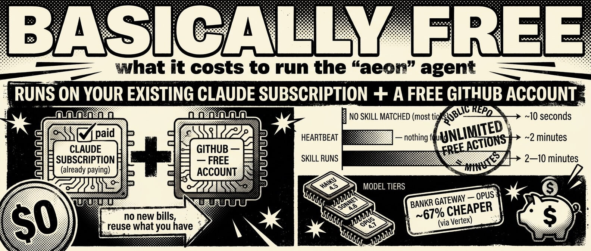

# Configuration & advanced reference

Everything here is optional. Aeon runs fine without any of it. The [README](../.github/README.md) covers setup; this is the deeper reference it links to.

## Skill chaining

Chain skills so outputs flow between them. Chains run as separate GitHub Actions workflow steps via `chain-runner.yml`:

```yaml
chains:
  digest-pipeline:
    schedule: "0 7 * * *"
    on_error: fail-fast       # or: continue
    steps:
      - parallel: [token-movers, github-trending]   # run concurrently
      - skill: digest, consume: [token-movers, github-trending]   # runs after; outputs injected
```

Each step runs as a separate workflow dispatch; outputs are saved to `output/.chains/{skill}.md` and injected into downstream steps that `consume:` them. `fail-fast` aborts on any failure, `continue` keeps going.

## Reactive triggers

Skills with `schedule: "reactive"` fire on conditions, not cron. The scheduler evaluates triggers after processing cron skills:

```yaml
reactive:
  skill-repair:
    trigger:
      - { on: "*", when: "consecutive_failures >= 3" }
```

## Scheduler frequency

Edit `.github/workflows/scheduler.yml`:

```yaml
schedule:
  - cron: '*/5 * * * *'    # every 5 min (default)
  - cron: '*/15 * * * *'   # every 15 min (saves Actions minutes)
  - cron: '0 * * * *'      # hourly (most conservative)
```

Claude only installs and runs when a skill actually matches - non-matching ticks cost ~10s.

## Capability tiers (read-only skills)

A skill declares its write blast-radius in SKILL.md frontmatter:

```yaml
mode: read-only   # may read the repo, fetch the web, and ./notify — but cannot mutate the repo
mode: write       # full access (the default): adds Write / Edit / git / gh / python3
```

`read-only` strips the repo-mutation tools from Claude Code's `--allowedTools` (`Write`, `Edit`, `Bash(git:*)`, `Bash(gh:*)`), so a research-and-notify skill **physically can't** commit, push, or open a PR — a post-run guard still saves its `memory/` + `output/` and reverts any stray write. Use it for pure read-and-notify skills; `write` (the default, a strict superset) for anything that writes code. It's the runtime half of the install-time [`capabilities:`](../docs/CAPABILITIES.md) hint.

## MCP servers in skill runs

Let skills **call** MCP servers (GitHub, a database, a paid API, your own) while they run in GitHub Actions. Opt-in and safe - with no `.mcp.json` at the repo root, runs are byte-identical to before.

```bash
cp docs/examples/mcp/.mcp.json.example .mcp.json   # then edit, commit, push
```

The example ships two working servers — `github` (uses the runner's built-in `GITHUB_TOKEN`) and `sequential-thinking` (no-auth stdio). On the next run the runner loads `.mcp.json` and auto-allows every server's tools, so a skill can just say *"use the github MCP server to …"*. Reference a server's secret with `${VAR}` (never commit the value) and set it in the dashboard — the runner resolves it from the repo's secrets with zero workflow editing, and skips a server (with a warning) when its secret is missing rather than breaking the skill.

Or skip the file entirely: the dashboard's **MCP** tab writes `.mcp.json` for you, lists **Featured** servers (e.g. [Base](https://mcp.base.org)) for one-click install, and tells you which secret each server needs.

## Cross-repo access

The built-in `GITHUB_TOKEN` is scoped to this repo only. For `github-monitor`, `pr-review`, and `feature` to work on your other repos, add a `GH_GLOBAL` personal access token: github.com/settings/tokens → Fine-grained → set repo access → grant Contents, Pull requests, Issues (read/write) → add as `GH_GLOBAL` secret. Skills use it when available and fall back to `GITHUB_TOKEN` automatically.

## Durable state without the churn

Per-skill execution state (`memory/cron-state.json` — status, success rate, quality) is **dual-written** by default: each run commits the file *and* appends an immutable event to a closed, append-only GitHub Issue (`aeon:cron-state`), so concurrent runs never race — no rewrite, force-push, or rebase-retry. The repo variable **`STATE_BACKEND`** switches this: `dual` (default) · `issues` (append-only, zero file churn) · `file` (legacy file-only). Chains record to the same ledger.

## LLM Gateways

<p align="center">
  
</p>

Aeon can power Claude Code **eight** ways. Two are **direct** to Anthropic; the other six route through a **gateway**. Add a credential in the dashboard's Authenticate modal and it's saved as the secret below. (Separately, the [Grok Build harness](harnesses.md) runs the `grok` CLI instead of Claude Code — that's a different axis from the gateways here.)

**Routing is automatic.** `aeon.yml` ships `gateway: { provider: auto }`, and each run resolves the live provider from *whichever secrets are set*, in priority order - so adding or removing a key changes routing with no re-config:

```
claude (CLAUDE_CODE_OAUTH_TOKEN) → anthropic (ANTHROPIC_API_KEY) →
openrouter → bankr → usepod → venice → surplus → grok → direct (fallback)
```

It runs as a **cascade**: the highest-priority provider whose key is set goes first, and on **any** failure (no credits, rate limit, outage, dud response) the run automatically falls over to the next provider whose key is set - so a dead provider degrades gracefully instead of failing the run, and it only errors out if *every* provider fails. The log prints `Routing attempt via '<provider>'` per hop (and `ran via fallback provider …` when it recovers).

Override the order with the repo variable **`GATEWAY_ORDER`** (space-separated names), or pin a single provider (which disables failover) by setting `gateway.provider` to `direct`/`bankr`/`openrouter`/`usepod`/`venice`/`surplus`/`grok` explicitly.

**Direct (`provider: direct`)** - the two Anthropic-native modes from [Authentication](../.github/README.md#authentication) in the README (Claude subscription via `CLAUDE_CODE_OAUTH_TOKEN`, Anthropic API via `ANTHROPIC_API_KEY`), no middleman. Point `ANTHROPIC_API_KEY` at any Anthropic-compatible endpoint with the `ANTHROPIC_BASE_URL` variable.

**Gateways** - route Claude through an alternative provider (cheaper Opus, crypto-settled, privacy-first…). Keys with a distinctive prefix are detected automatically; UsePod and Venice have no prefix, so pick them in the dropdown:

| Gateway | Secret | Notes |
|---------|--------|-------|
|  [Bankr](https://docs.bankr.bot/llm-gateway/overview) | `BANKR_LLM_KEY` | Discounted Opus access |
|  [OpenRouter](https://openrouter.ai) | `OPENROUTER_API_KEY` | Anthropic-native passthrough; lowest-risk option |
|  [UsePod](https://usepod.ai) | `USEPOD_TOKEN` | Solana marketplace; token is embedded in the base URL, keep it secret |
|  [Venice](https://venice.ai) | `VENICE_API_KEY` | Privacy-first; OpenAI-compatible, bridged via a per-run [claude-code-router](https://github.com/musistudio/claude-code-router) sidecar. Point it at any Venice-compatible endpoint with the `VENICE_BASE_URL` repo variable |
|  [Surplus](https://surplusintelligence.ai) | `SURPLUS_API_KEY` | Routed via The Bridge; settles in USDC on Base - fund the wallet + `approve()` once before use |
|  [Grok (xAI)](https://x.ai/api) | `XAI_API_KEY` | Anthropic-native passthrough to `api.x.ai`; the `xai-…` key is auto-detected. Set the model with the `GROK_MODEL` repo variable. Same key also powers the [grok harness](harnesses.md) |

#### Adding a gateway

Wiring a new provider through the dashboard registry, resolver, and workflow `env:` is a contributor task — the step-by-step (native vs sidecar tiers, the five files, how to verify the loop) lives in [`CONTRIBUTING.md`](../.github/CONTRIBUTING.md#contributing-an-llm-gateway).

## Strategy

`STRATEGY.md` is Aeon's north-star - your overarching goal, top priorities, audience, and hard constraints. It's imported into `CLAUDE.md`, so it rides along in the context of **every** skill run: when a choice isn't otherwise determined, the strategy breaks the tie ("showcase real output over new features", "depth over breadth"). Keep it tight (it costs tokens every run) and specific (a vague strategy can't break a tie).

Set it three ways from the dashboard's **Strategy** tab:

- **Write it** - edit `STRATEGY.md` inline; Save commits and pushes automatically.
- **Templates** - start from a blank scaffold or one of five archetypes (Indie SaaS, Open-source maintainer, Researcher/Writer, Crypto/Agent, Creator) and fill in the bracketed bits.
- **Build it** - give the `strategy-builder` skill a one-line goal (and optionally a repo or links). It reads your brief plus the repo README and `memory/MEMORY.md`, then drafts a tight north-star / priorities / audience / constraints strategy and commits it. No API key needed; runs as a GitHub Action, so hit **Pull** when it finishes.

## Soul

By default Aeon has no personality. The **Soul** tab gives it one - `soul/SOUL.md` (identity, worldview, opinions) and `soul/STYLE.md` (voice, vocabulary) are read on every run, so notifications and content sound like you. Four ways to set it:

- **Write it** - edit SOUL.md / STYLE.md inline; Save commits and pushes.
- **Templates** - start from a blank scaffold or an archetype (Founder, Researcher, Creator).
- **Install a real soul** - one click pulls a complete example (Karpathy, Garry Tan, Steipete, Vivian Balakrishnan) from the [soul.md](https://github.com/aeonfun/soul.md) gallery into your `soul/`.
- **Build from your handle** - give the `soul-builder` skill any of an X handle, your full name (web search), or links (LinkedIn, site, blog, GitHub). It reads them and drafts SOUL.md + STYLE.md + voice examples in your style. Set `XAI_API_KEY` for the richest read of your actual X timeline - it falls back to web search without it.

Prefer files? Fork [soul.md](https://github.com/aeonfun/soul.md), fill in `SOUL.md` / `STYLE.md` / `examples/good-outputs.md` (10–20 calibration samples), and drop them under `soul/` - same result. The `## Voice` section of `CLAUDE.md` reads them automatically, so identity propagates to every skill.

**Quality check:** soul files work when they're specific enough to be wrong. *"I think most AI safety discourse is galaxy-brained cope"* is useful; *"I have nuanced views on AI safety"* is not.

## Fleet Watcher (authorization layer)

Optional inline ALLOW/BLOCK authorization in front of every skill run: each workflow asks a self-hosted **Fleet Watcher** control plane *"is this allowed?"* before Claude starts (BLOCK = the run exits non-zero and Claude never runs, with an audit ref recorded). It's already wired into `aeon.yml` as two opt-in steps that no-op unless `FLEET_ENDPOINT` + `FLEET_TOKEN` are set — and fail **closed** (skill doesn't run) if Fleet is unreachable when they are. Define your red lines (per-skill caps, counterparty allowlists, dangerous-string patterns) in its dashboard; the postflight always runs so blocked skills are still recorded.

## Remote dashboard access

The dashboard's `/api/*` routes drive `gh workflow run` and read/write repo secrets, so they're gated to loopback callers by default - no remote callers, no DNS-rebinding from a malicious page. To reach the dashboard from another machine or over a tunnel (Tailscale, ngrok, reverse proxy):

| Env var | Behaviour |
|---|---|
| `AEON_DASHBOARD_ALLOWED_HOSTS=aeon.local,box.tail-xxx.ts.net` | Extends the loopback allowlist by hostnames (comma-separated, case- and port-insensitive) |
| `AEON_DASHBOARD_ALLOW_ANY_HOST=1` | Disables Host-header checking entirely. Only for a trusted reverse proxy that terminates `Host` upstream - loudly insecure otherwise |

The gate also rejects state-changing requests whose `Origin` isn't allowlisted, so a malicious page can't drive `/api/secrets` via a no-cors POST. Code: [`apps/dashboard/proxy.ts`](../apps/dashboard/proxy.ts) + [`apps/dashboard/lib/security/api-gate.ts`](../apps/dashboard/lib/security/api-gate.ts).

## Two-repo strategy

This repo is a public template. Run your own instance as a **private fork** so memory, articles, and API keys stay private:

```bash
git remote add upstream https://github.com/aeonfun/aeon.git
git fetch upstream
git merge upstream/main --no-edit
```

Your `memory/`, `output/`, and personal config won't conflict - they're in files that don't exist in the template.

## GitHub Actions cost



| Scenario | Cost |
|----------|------|
| No skill matched (most ticks) | ~10s - checkout + bash + exit |
| Skill runs | 2–10 min depending on complexity |
| Heartbeat (nothing found) | ~2 min |
| **Public repo** | **Unlimited free minutes** |

Private repos: Free plan = 2,000 min/mo, Pro/Team = 3,000 + $0.008/min overage. To reduce usage: switch to `*/15` or hourly cron, disable unused skills, keep the repo public. Every run logs token usage to `memory/token-usage.csv` for a per-skill, per-model cost breakdown.
